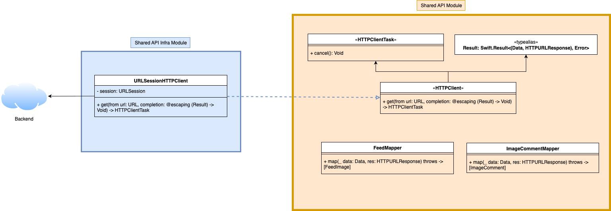

# EssentialFeedCaseStudy


## Overview

EssentialFeed is a modular iOS application built with Clean Architecture principles and Test-Driven Development (TDD). The app displays a feed of images with comments functionality, demonstrating best practices for iOS development including offline-first architecture, caching strategies, and comprehensive testing.

### Languages and Tools:


## Architecture

### 🏗️ Clean Architecture Layers

The project follows Clean Architecture with clear separation of concerns:

#### Networking Module
- **HTTPClient Protocol**: Abstract network interface for dependency inversion
- **URLSessionHTTPClient**: Concrete URLSession-based implementation
- **API Mappers**: Data transformation (FeedMapper, ImageCommentMapper, FeedImageDataMapper)
- **Endpoints**: URL construction and API contract definition (FeedEndpoint, ImageCommentsEndpoint)



#### Persistence Module
- **Store Protocols**: Abstract storage interfaces (FeedStore, FeedImageDataStore)
- **CoreDataFeedStore**: Production Core Data implementation with background contexts
- **InMemoryFeedStore**: Fast in-memory implementation for testing and fallback
- **CodableFeedStore**: File-system based JSON storage alternative
- **Local Loaders**: Cache management (LocalFeedLoader, LocalFeedImageDataLoader)
- **Cache Policies**: Data validation and invalidation strategies


#### UI + Presentation Module
- **Generic Presenters**: Reusable presentation logic (`LoadResourcePresenter<Resource, View>`)
- **View Protocols**: Interface segregation (ResourceView, ResourceLoadingView, ResourceErrorView)
- **View Controllers**: Passive UI components (ListViewController, FeedImageCellController)
- **View Models**: UI-ready data structures with formatting and localization
- **Cell Controllers**: Individual cell presentation logic with state management
- **UI Helpers**: Extensions and utilities for smooth user experience


#### Composition Root
- **SceneDelegate**: Central orchestrator for all cross-cutting concerns
- **Dependency Injection**: Single point where all components are wired together
- **Infrastructure Configuration**: Threading, logging, caching, and fallback strategies
- **Policy Decisions**: Remote-first vs cache-first, error handling policies
- **Environment Setup**: Production vs testing configurations


## 🧪 Testing Strategy

- **Test-Driven Development**: Red-Green-Refactor workflow
- **Mocking**: Lightweight stubs and fakes for controlled testing
- **Code Coverage**: Continuous monitoring and improvement
- **Test Automation**: CI/CD pipelines for every change

- **Unit Tests**: Isolated, fast, and comprehensive coverage of business logic
- **Integration Tests**: End-to-end scenarios with realistic dependencies
- **End-to-End-Tets**: Test expected response from server
- **Acceptance Tests**: Human-readable acceptance criteria
- **Snapshot Testing**: Visual regression detection with reference images


### 🎯 Key Design Patterns

- **Repository Pattern**: Abstracts data access with local/remote fallback
- **Adapter Pattern**: Bridges different interfaces and protocols
- **Composite Pattern**: Builds complex UI from reusable components
- **Observer Pattern**: Reactive programming with Combine framework
- **Strategy Pattern**: Pluggable implementations for different data sources

## Project Structure
```
EssentialFeed-Starter-Project/
├── EssentialApp/                    # Main iOS Application
│   ├── EssentialApp/
│   │   ├── SceneDelegate.swift      # App lifecycle and dependency injection
│   │   └── Composer/                # Dependency injection layer
│   └── EssentialAppTests/           # Integration and acceptance tests
├── EssentialFeed/                   # Core Framework
│   ├── EssentialFeed/               # Business Logic
│   │   ├── Feed Feature/            # Feed domain models and protocols
│   │   ├── Feed API/                # Remote data source implementations  
│   │   ├── Feed Cache/              # Local data source implementations
│   │   ├── Feed Presentation/       # Feed presentation logic
│   │   ├── Image Comment Feature/   # Comment domain models
│   │   ├── Image Comment API/       # Comment remote data sources
│   │   ├── Image Comment Presentation/ # Comment presentation logic
│   │   ├── Shared API/              # Common networking components
│   │   └── Shared Presentation/     # Reusable presentation components
│   ├── EssentialFeediOS/            # UI Framework
│   │   ├── Feed UI/                 # Feed-specific UI components
│   │   └── Shared UI/               # Reusable UI components
│   └── Tests/                       # Unit tests for all modules
```

## Core Features

### 📱 Feed Display
- **Infinite Scroll**: Paginated loading with pull-to-refresh
- **Image Caching**: Efficient image loading with local caching
- **Offline Support**: Local cache fallback when network unavailable
- **Error Handling**: Graceful error states and retry mechanisms

### 💬 Comments System
- **Image Comments**: View comments for individual feed images
- **Real-time Loading**: Dynamic comment loading with loading states